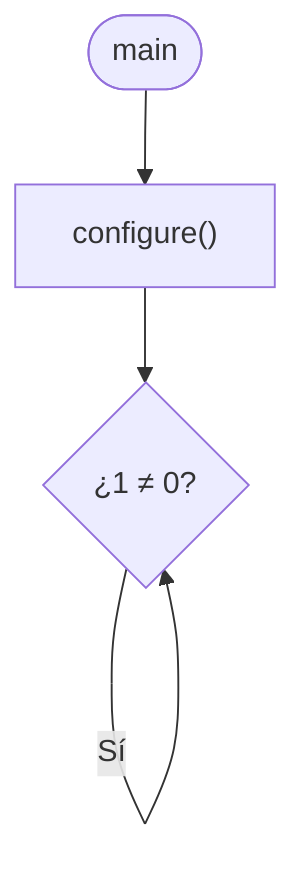
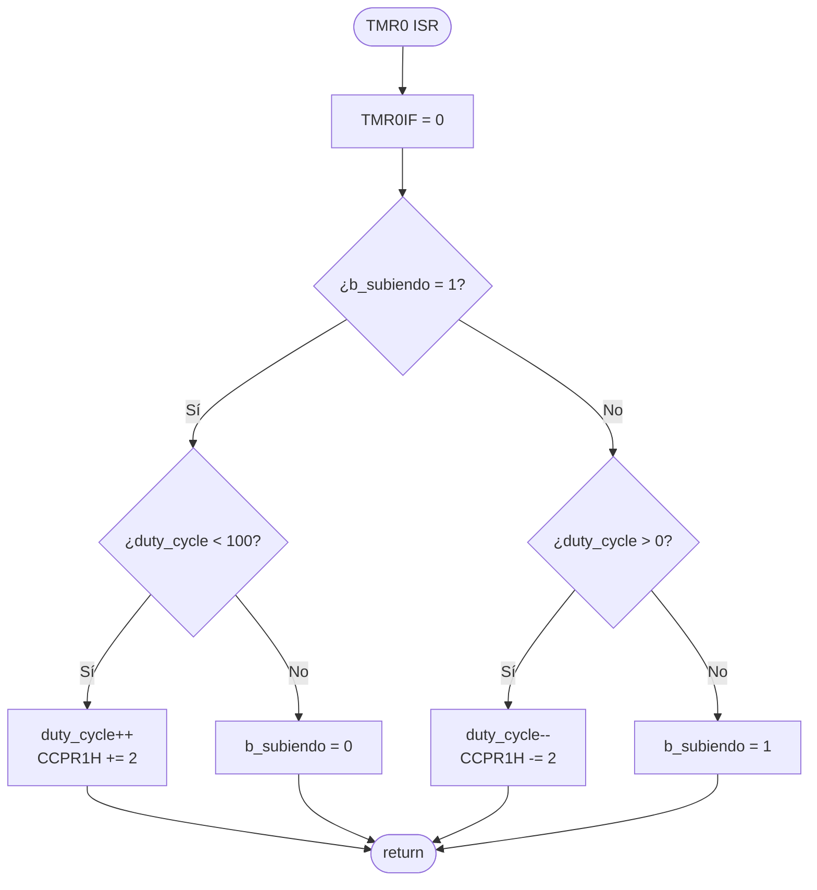

# PIC18F47Q10 – Fading LED

> [!NOTE]
> Este proyecto forma parte de [**TheAssemblyChronicles-PIC**](https://remgo696.github.io/TheAssemblyChronicles-PIC/), una serie de proyectos, documentación y guías rápidas orientadas al aprendizaje de los microcontroladores PIC18F. 
Puedes encontrar más proyectos [aquí](https://remgo696.github.io/TheAssemblyChronicles-PIC/proyectos/).

---

## Descripción del Proyecto

Se implementa un LED que se enciende y apaga de forma suave (*fading*) sobre la placa **PIC18F47Q10 Curiosity Nano**. Partiendo del LED apagado, su intensidad luminosa aumenta gradualmente hasta alcanzar el brillo máximo y, acto seguido, disminuye de vuelta a cero. Este ciclo se repite indefinidamente.

Para lograrlo se emplean tres periféricos del PIC18F47Q10:

| Periférico | Función |
|:-----------|:--------|
| **Oscilador** | Reloj del sistema a 2 MHz |
| **TMR0** | Genera una interrupción a ≈ 120 Hz (cada ≈ 8,3 ms) |
| **CCP1 (PWM)** | Señal PWM de periodo 400 µs cuyo *duty cycle* varía ±1 % en cada interrupción de TMR0 |

La salida PWM se dirige al pin **RC0** mediante el módulo PPS.

<!-- La imagen se añadirá cuando esté disponible -->


---

## Configuración del Reloj del Sistema (2 MHz)

Se utiliza el oscilador interno de alta frecuencia (HFINTOSC) a 2 MHz sin divisor. Para ello se configuran tres registros.

### Registros del Oscilador

**OSCCON1** – Oscillator Control Register 1

| Bit | 7 | 6:4 | 3:0 |
|:---:|:---:|:---:|:---:|
| **Campo** | — | NOSC[2:0] | NDIV[3:0] |
| **Permisos** | — | R/W | R/W |

**OSCFRQ** – HFINTOSC Frequency Selection Register

El registro `OSCFRQ` solo tiene un campo y se descompone como  `-[7:3]:FRQ[2:0]`.

| FRQ[2:0] | Frecuencia HFINTOSC |
|:--------:|:-------------------:|
| 000 | 1 MHz |
| 001 | 2 MHz |
| 010 | 4 MHz |
| 011 | 8 MHz |
| 100 | 12 MHz |
| 101 | 16 MHz |
| 110 | 32 MHz |
| 111 | 64 MHz |

**OSCEN** – Oscillator Enable Register

| Bit | 7 | 6 | 5 | 4 | 3 | 2 | 1:0 |
|:---:|:---:|:---:|:---:|:---:|:---:|:---:|:---:|
| **Campo** | EXTOEN | HFOEN | MFOEN | LFOEN | SOSCEN | ADOEN | — |
| **Permisos** | R/W | R/W | R/W | R/W | R/W | R/W | — |
| **Reset** | 0 | 0 | 0 | 0 | 0 | 0 | — |

### Valores seleccionados

| Registro | Valor | Justificación |
|:--------:|:-----:|:--------------|
| `OSCCON1` | `0x60` | NOSC = 110 (HFINTOSC), NDIV = 0000 (1:1) |
| `OSCFRQ`  | `0x01` | FRQ = 001 → 2 MHz |
| `OSCEN`   | `0x40` | HFOEN = 1 → habilitar HFINTOSC |

Con esta configuración, $F_{osc} = 2\ \text{MHz}$.

```c
OSCCON1 = 0x60;  // HFINTOSC, sin divisor
OSCFRQ  = 0x01;  // 2 MHz
OSCEN   = 0x40;  // Habilitar HFINTOSC
```

---

## Configuración del Módulo CCP en Modo PWM

### Periodo de 400 µs

La señal PWM que controlará el LED tiene un periodo de $T_{PWM} = 400\ \mu s$ (equivalente a $f_{PWM} = 2{,}5\ \text{kHz}$). El periodo lo establece el timer TMR2, cuya cuenta máxima se almacena en el registro `T2PR`:

$$T2PR = \frac{T_{PWM} \times F_{osc}}{4 \times Prescaler_{TMR2}} - 1$$

Con $F_{osc} = 2\ \text{MHz}$ y $Prescaler_{TMR2} = 1$:

$$T2PR = \frac{400 \times 10^{-6} \times 2 \times 10^{6}}{4 \times 1} - 1 = 200 - 1 = 199$$

### Duty Cycle (± 1 %)

El *duty cycle* de la señal PWM determina la intensidad luminosa del LED. Se incrementa o decrementa en 1 % en cada interrupción del TMR0 (≈ 120 Hz), lo que produce el efecto de encendido y apagado suave.

El tiempo en alto correspondiente a un 1 % del periodo es:

$$T_{ON}(1\\%) = \frac{T_{PWM}}{100} = \frac{400\ \mu s}{100} = 4\ \mu s$$

El valor de 10 bits que representa ese 1 % en el registro `CCPR1` se calcula como:

$$\text{CCPRx value}(1\\%) = \frac{T_{ON} \times F_{osc}}{Prescaler_{TMR2}} = \frac{4 \times 10^{-6} \times 2 \times 10^{6}}{1} = 8$$

Usando el formato **justificado a la izquierda** (`FMT = 1`), el valor de 10 bits se distribuye en `CCPR1H` (los 8 bits más significativos) y `CCPR1L[7:6]` (los 2 bits menos significativos):

$$8 = 00\ 0000\ 1000_{(2)} \Rightarrow CCPR1H = 0000\ 0010_{(2)} = 2,\quad CCPR1L[7:6] = 00$$

Por lo tanto, para cada paso de ± 1 %, basta con **sumar o restar 2 a `CCPR1H`**.

> **Verificación:** Al 100 %, se habrán sumado $100 \times 2 = 200$ a `CCPR1H`. El valor de 10 bits resultante es $200 \times 4 = 800 = (T2PR + 1) \times 4$, lo cual indica que la señal se mantiene en alto durante todo el periodo. ✓

### Registros del CCP y TMR2

**CCPTMRS** – CCP Timer Selection Register

| Bit | 3:2 | 1:0 |
|:---:|:---:|:---:|
| **Campo** | C2TSEL[1:0] | C1TSEL[1:0] |
| **Permisos** | R/W | R/W |
| **Reset** | 00 | 00 |

| C1TSEL[1:0] | Timer asociado al CCP1 |
|:-----------:|:----------------------:|
| 01 | TMR2 |
| 10 | TMR4 |
| 11 | TMR6 |

**RxyPPS** – PPS Output Selection (Banco 0x0E)

| RxyPPS | Módulo | Puertos destino |
|:------:|:------:|:---------------:|
| 0x05 | CCP1 | RB, RC |
| 0x06 | CCP2 | RB, RC |

**CCP1CON** – CCP1 Control Register

| Bit | 7 | 6 | 5 | 4 | 3:0 |
|:---:|:---:|:---:|:---:|:---:|:---:|
| **Campo** | EN | — | OUT | FMT | MODE[3:0] |
| **Permisos** | R/W | — | RO | R/W | R/W |
| **Reset** | 0 | — | x | 0 | 0000 |

- `EN = 1`: habilitar CCP1
- `FMT = 1`: justificado a la izquierda
- `MODE = 1100`: modo PWM

**CCPR1H:L** – Duty Cycle (10 bits)

Con `FMT = 1` (justificado a la izquierda):

| CCPR1H[7:0] | CCPR1L[7:6] |
|:-----------:|:-----------:|
| Bits 9:2 del valor de 10 bits | Bits 1:0 del valor de 10 bits |

**T2CON** – Timer2 Control Register

| Bit | 7 | 6:4 | 3:0 |
|:---:|:---:|:---:|:---:|
| **Campo** | ON | CKPS[2:0] | OUTPS[3:0] |
| **Permisos** | R/W | R/W | R/W |
| **Reset** | 0 | 000 | 0000 |

- `ON = 1`: habilitar TMR2
- `CKPS = 000`: prescaler 1:1

> [!WARNING]
> El PostScaler del TMR2 no afecta el periodo de la señal PWM, solo influye en la generación de interrupciones del timer.

### Configuración completa del CCP1

```c
/* PPS: CCP1 → RC0 */
RC0PPS = 0x05;               // Dirigir la salida CCP1 al pin RC0
ANSELCbits.ANSELC0 = 0;      // RC0 como digital
TRISCbits.TRISC0 = 0;        // RC0 como salida

/* CCP1 + TMR2 */
CCPTMRSbits.C1TSEL = 1;      // CCP1 usa TMR2
T2PR = 199;                  // Periodo PWM = 400 µs
CCP1CON = 0x9C;              // EN=1, FMT=1, MODE=1100 (PWM)
CCPR1H = 0x00;
CCPR1L = 0x00;               // Duty cycle inicial = 0 %
T2CLKCON = 0x01;             // Fuente de reloj TMR2 = Fosc/4
T2CON = 0x80;                // TMR2 ON, prescaler 1:1
```

---

## Configuración del TMR0 (≈ 120 Hz)

El TMR0 se configura en **modo 8 bits** para generar una interrupción periódica a ≈ 120 Hz. Esta frecuencia define la velocidad a la que cambia el *duty cycle* del PWM.

### Cálculos

Se usa $F_{osc}/4 = 500\ \text{kHz}$ como fuente de reloj y un prescaler de 1:32.

$$TMR0H = \frac{F_{osc}/4}{f_{int} \times Prescaler_{TMR0}} - 1 = \frac{500\,000}{120 \times 32} - 1 \approx 130{,}2 - 1 \approx 129$$

**Frecuencia real de interrupción:**

$$f_{int} = \frac{F_{osc}/4}{(TMR0H + 1) \times Prescaler_{TMR0}} = \frac{500\,000}{130 \times 32} = 120{,}19\ \text{Hz}$$

Con esta frecuencia, el LED tarda $\frac{100}{120{,}19} \approx 0{,}83\ s$ en pasar de 0 % a 100 % (y lo mismo para volver a 0 %), dando un ciclo completo de ≈ 1,7 s.

### Registros del TMR0

**T0CON0** – Timer0 Control Register 0

| Bit | 7 | 6 | 5 | 4 | 3:0 |
|:---:|:---:|:---:|:---:|:---:|:---:|
| **Campo** | EN | — | OUT | MD16 | OUTPS[3:0] |
| **Permisos** | R/W | — | RO | R/W | R/W |
| **Reset** | 0 | — | 0 | 0 | 0000 |

- `EN = 1`: habilitar TMR0
- `MD16 = 0`: modo 8 bits
- `OUTPS = 0000`: postscaler 1:1

**T0CON1** – Timer0 Control Register 1

| Bit | 7:5 | 4 | 3:0 |
|:---:|:---:|:---:|:---:|
| **Campo** | T0CS[2:0] | T0ASYNC | T0CKPS[3:0] |
| **Permisos** | R/W | R/W | R/W |
| **Reset** | 000 | 0 | 0000 |

| T0CS[2:0] | Fuente de reloj |
|:---------:|:----------------|
| 010 | $F_{osc}/4$ |
| 011 | HFINTOSC |
| 101 | MFINTOSC (500 kHz) |

| T0CKPS[3:0] | Prescaler |
|:-----------:|:---------:|
| 0000 | 1:1 |
| 0011 | 1:8 |
| 0100 | 1:16 |
| 0101 | 1:32 |
| 0110 | 1:64 |

### Valores seleccionados

| Registro | Valor | Justificación |
|:--------:|:-----:|:--------------|
| `T0CON0` | `0x80` | EN=1, modo 8 bits, postscaler 1:1 |
| `T0CON1` | `0x45` | T0CS=010 ($F_{osc}/4$), T0ASYNC=0, T0CKPS=0101 (1:32) |
| `TMR0H`  | `129`  | Cuenta 0 → 129 (130 cuentas) → ≈ 120 Hz |

```c
T0CON0 = 0x80;  // TMR0 ON, 8-bit, postscaler 1:1
T0CON1 = 0x45;  // Fosc/4, síncrono, prescaler 1:32
TMR0H  = 129;   // Periodo → 120,19 Hz
```

Para que TMR0 genere interrupciones, se habilita `TMR0IE` en `PIE0` y `GIE` en `INTCON`:

```c
PIR0bits.TMR0IF = 0;   // Limpiar bandera de interrupción
PIE0bits.TMR0IE = 1;   // Habilitar interrupción de TMR0
INTCONbits.GIE  = 1;   // Habilitar interrupciones globales
```

---

## Programa

### Descripción general

El programa se compone de dos partes: la **rutina principal** y la **rutina de interrupción del TMR0**.

La rutina principal se limita a llamar a la función `configure()`, que inicializa todos los periféricos (oscilador, PWM, TMR0 e interrupciones). Después, entra en un bucle infinito vacío, ya que toda la lógica del *fading* se ejecuta dentro de la rutina de interrupción.

La rutina de interrupción del TMR0 se dispara cada ≈ 8,3 ms (120 Hz). En cada invocación:

1. Se baja la bandera `TMR0IF`.
2. Se comprueba la bandera `b_subiendo`:
   - Si `b_subiendo == 1` (encendiendo): se incrementa el *duty cycle* en 1 %. Al llegar a 100 %, se pone `b_subiendo = 0`.
   - Si `b_subiendo == 0` (apagando): se decrementa el *duty cycle* en 1 %. Al llegar a 0 %, se pone `b_subiendo = 1`.

### Rutina principal



### Rutina de interrupción (TMR0)



---

## Licencia

Este proyecto se distribuye bajo la licencia [MIT](LICENSE).
